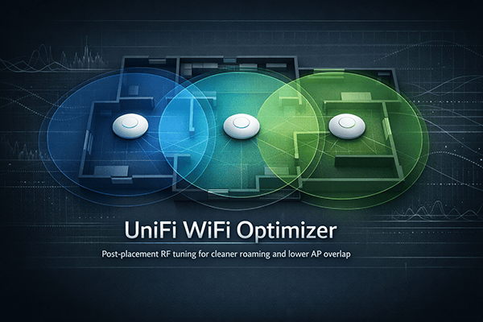

# UniFi WiFi Optimizer

> RF tuning and WLAN baseline review for UniFi access points — transmit power, roaming, and minimum RSSI recommendations derived from AP-to-AP neighbor scans.

<p align="center">
  
</p>

`UniFiWiFiOptimizer` is a Bash tool for post-placement UniFi WLAN review and RF tuning.
It reads radio configuration and WLAN settings from the UniFi Network API, compares them against shipped best-practice WLAN profiles, collects AP-to-AP neighbor scan data via SSH, and generates recommendations for:

- profile-based WLAN best practices for general, IoT, and guest networks
- access point settings: `Transmit Power`, `Roaming Assistant`, `Minimum RSSI`

It does not write changes back to the controller — all recommendations must be applied manually. The SSH neighbor scan uses dedicated scan interfaces, so normal client WiFi service should remain unaffected on supported UniFi APs and firmware.

→ See [docs/EXAMPLE.md](docs/EXAMPLE.md) for a complete five-AP example with sample output.

## Requirements

- UniFi Network Application 8.0+ with API key support
- UniFi access points managed by that application, with `Device SSH Authentication` enabled
- local tools: `bash`, `awk`, `curl`, `python3`, `ruby`, `ssh`
- `sshpass` — optional, only needed for password-based SSH login

## Quick Start

1. In UniFi Network: **Settings → System → Device SSH Settings** — enable `Device SSH Authentication`, set `Username` and `Password`, and optionally add an SSH public key.
2. In UniFi Network: **Settings → Integrations → Create API Key** — create a key and copy it.
3. Copy `config.yaml.example` to `config.yaml`, set `controller.url`, `api_key`, and `devices.ssh` credentials.
4. Define your AP neighbor model in `config.yaml` and review `profiles.yaml`.
5. Run `./UniFiWiFiOptimizer`.

## Configuration

Site configuration lives in `config.yaml`. Reusable WLAN baselines live in `profiles.yaml`.

`config.yaml`:

```yaml
controller:
  url: https://unifi.example.local
  api_key: ...

devices:
  ssh:
    user: ubnt
    password: ...

sites:
  default:
    environment: residential

    wlans:
      General: general_5g
      IoT: iot
      Guest: guest_5g

    neighbors:
      AP1: [AP2, AP4]
      AP2: [AP1, AP3, AP4, AP5]
      AP3: [AP2, AP5]
      AP4: [AP1, AP2, AP5]
      AP5: [AP2, AP3, AP4]
```

Key settings:

| Key | Description |
|---|---|
| `controller.url` | Base URL of the UniFi Network application |
| `controller.api_key` | API key for all read-only controller requests |
| `devices.ssh.user` | SSH username from `Device SSH Authentication` |
| `devices.ssh.password` | SSH password for password-based login; omit to use key/agent auth |
| `sites.<site>.environment` | RF environment preset or custom path loss exponent used to derive the TX corridor |
| `sites.<site>.wlans` | Maps UniFi WLAN names to profile names |
| `sites.<site>.neighbors` | AP-to-AP neighbor model; names must match UniFi device names exactly (case-sensitive) |

Environment presets:

- `open`: large open spaces, retail, low attenuation
- `residential`: homes and apartments
- `office`: typical office floorplans
- `obstructed`: concrete, brick, multi-wall layouts
- custom value: typical practical values are around `2.0` to `4.0`

`config.yaml` contains the API key and optionally the SSH password — protect it accordingly:

```bash
chmod 600 config.yaml
```

For SSH, prefer key-based authentication (see [SSH Access](#ssh-access)).

`profiles.yaml`:

```yaml
profiles:
  general_5g:
    wifi_bands:
      - 2g
      - 5g
    fast_roaming: true
    minrate_24_kbps: 11000
    minrate_5_kbps: 24000
    multicast_broadcast_blocker: false
    multicast_to_unicast: false
    proxy_arp: true
    security_protocols:
      - WPA2/WPA3
      - WPA2/WPA3 Enterprise
    pmf: Optional
    hide_wifi_name: false
    client_device_isolation: false
    sae_anti_clogging: 10
    sae_sync_time: 5
    bss_transition: true
    uapsd: false
    dtim_24: 1
    dtim_5: 3
    group_rekey: 3600
    ap_name_in_beacon: false
```

Profiles ship ready-to-use and can be adjusted if your environment or policy requires different WLAN settings. The shipped presets are `general_5g`, `general_6g`, `guest_5g`, `guest_6g`, and `iot`. Boolean and enum fields are compared directly against the controller; numeric fields define expected best-practice values.

Common field groups in `profiles.yaml`:

- `wifi_bands`, `mlo`: expected band availability and 6 GHz/MLO behavior
- `fast_roaming`, `bss_transition`, `uapsd`: roaming and client behavior controls
- `minrate_*`, `dtim_*`, `group_rekey`: baseline performance and airtime settings
- `multicast_*`, `proxy_arp`, `client_device_isolation`: broadcast/multicast handling and client isolation
- `security_protocols`, `pmf`, `sae_*`: security posture and WPA3/SAE-related expectations
- `hide_wifi_name`, `ap_name_in_beacon`: SSID visibility and beacon presentation

- `mlo` and `dtim_6` are only required in profiles that include `6g`
- `minrate_*` and `dtim_*` are only required for bands listed in `wifi_bands`
- `group_rekey: 0` renders as `Disabled`

## Profiles

| Profile | Intent |
|---|---|
| `general_5g` | Performance and security for primary WLANs on 2.4/5 GHz (WPA2/WPA3, fast roaming, high data rates) |
| `general_6g` | Same baseline with 6 GHz and MLO checks enabled |
| `guest_5g` | Security isolation and compatibility for guest/public networks on 2.4/5 GHz (client isolation, broad protocol support) |
| `guest_6g` | Same baseline with 6 GHz and MLO checks enabled |
| `iot` | Compatibility for older or fragile devices, ideally on 2.4 GHz only (low data rates, broad protocol support) |

Use `*_6g` profiles only when the WLAN should actually use 6 GHz. If not all relevant APs support it, `general_5g` / `guest_5g` are the safer default.

## SSH Access

SSH key authentication is recommended:

```bash
ssh-copy-id ubnt@your-ap.local
```

Password-based login also works — set `devices.ssh.password` in `config.yaml`. In that case, `sshpass` must be installed. If the key is omitted, key/agent auth is used automatically.

## Recommended Workflow

1. Place APs correctly.
2. Let UniFi handle channel planning first (e.g. Channel AI).
3. Map each WLAN to the appropriate profile in `config.yaml`.
4. Define the AP neighbor model in `config.yaml`.
5. Run `./UniFiWiFiOptimizer`.
6. Fix per-WLAN profile deviations first.
7. Apply per-AP RF recommendations that make sense for your site.
8. Re-test with real clients.

## Output

Each site report is structured in three parts:

- **Environment**: site-level RF target corridor derived from `environment`
- **WLAN**: per-SSID/profile best-practice comparison from `profiles.yaml`
- **Access Points**: per-AP neighbor RSSI data and RF recommendations

## Algorithm

TX Power targets the center of a corridor derived from the RF environment and AP-to-AP neighbor RSSI:

```
TX_LO = ROAM_TARGET − 10 · n · log₁₀(100 / 60)
TX_HI = TX_LO + CORRIDOR_WIDTH
```

The path loss exponent `n` is set per site via `environment:`. Values are based on ITU-R P.1238-13.

| Recommendation | Value |
|---|---|
| TX Power target | corridor center (`TX_LO + 3 dBm`) |
| Roaming Assistant | `ROAM_TARGET` = −67 dBm (Cisco VoWLAN guideline) |
| Minimum RSSI | `TX_LO` when you choose to enforce a hard disconnect threshold |

For the full derivation, see [docs/ALGORITHM.md](docs/ALGORITHM.md).

## Scope and Limits

Designed for homelabs, homes, apartments, and small to medium offices with manually managed UniFi deployments and known AP neighbor relationships.

Does not replace AP placement, channel planning, site surveys, capacity planning, or client-side validation.

- AP recommendations cover 2.4 GHz and 5 GHz; 6 GHz is profile-only
- Depends on model-/firmware-specific AP scan interface naming and MAC offset conventions
- `Band Steering` is not evaluated (not available via API) — review manually in UniFi Network

## References

- Ubiquiti: [UniFi WiFi SSID and AP Settings Overview](https://help.ui.com/hc/en-us/articles/32065480092951-UniFi-WiFi-SSID-level-Settings-Overview)
- Ubiquiti: [Understanding and Implementing Minimum RSSI](https://help.ui.com/hc/en-us/articles/221321728-Understanding-and-Implementing-Minimum-RSSI)
- Cisco: [Site Survey Guidelines for WLAN Deployment](https://www.cisco.com/c/en/us/support/docs/wireless/5500-series-wireless-controllers/116057-site-survey-guidelines-wlan-00.html)
- ITU-R P.1238-13: Indoor propagation path loss exponents by environment
