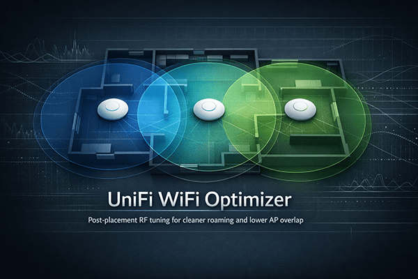

# UniFi WiFi Optimizer

> RF tuning and WLAN baseline review for UniFi access points — transmit power, roaming, and minimum RSSI recommendations derived from AP-to-AP neighbor scans.

<p align="center">
  
</p>

`UniFi WiFi Optimizer` is a Bash tool for post-placement UniFi WLAN review and RF tuning.
It reads radio configuration and WLAN settings from the UniFi Network API, compares them against shipped WLAN profiles, collects AP-to-AP neighbor scan data via SSH, and generates recommendations for:

- profile-based WLAN best practices for Standard, IoT, Hotspot, Throughput, and Latency profiles, including a Roaming Assistant compliance check
- access point settings: `Transmit Power`, `Minimum RSSI`

The shipped profiles map either to current UniFi defaults (`Standard`, `IoT`) or to optimized presets for specific use cases such as public hotspots, throughput-focused WLANs, and low-latency WLANs.

AP recommendations are derived from AP-to-AP neighbor scan RSSI and target the long-established practical design goal of about 20% cell overlap at -67 dBm, adjusted for the configured RF environment such as open space, office, or obstructed layouts.

The Roaming Assistant threshold is computed per WLAN from the corridor lower bound `TX_LO`, aggregated (as a conservative minimum) across the APs that broadcast that WLAN. When the weakest relevant neighbor falls below the corridor, the threshold is additionally capped against that neighbor instead of using a fixed -67 dBm for every AP. (UniFi's controller UI renamed this setting to "Handoff Suggestions (802.11v)" in Network Application 10.4.57; the underlying API field was separately confirmed to have moved from radio level to WLAN level, though the exact version where that happened is unconfirmed — see [docs/ALGORITHM.md](docs/ALGORITHM.md#7-roaming-assistant).)

AP-level recommendations (TX power, Minimum RSSI) are radio-scoped in UniFi and are not derived from the WLAN profile assigned to an SSID; Roaming Assistant is WLAN-scoped and appears as a profile compliance check instead.

All recommendations are applied manually in UniFi Network. The SSH neighbor scan detects scan-capable interfaces automatically: on MediaTek-based APs (U6 family) it uses the dedicated managed interfaces (`apcli0`/`apclii0`); on Qualcomm-based APs (U7 family) it uses AP interfaces that advertise the `SET_SCAN_DWELL` PHY capability. Both approaches perform off-channel scanning while maintaining client service.

For the full RF derivation, see [docs/ALGORITHM.md](docs/ALGORITHM.md).

## Requirements

- UniFi Network Application `10.0.162` or later
- UniFi AP firmware `6.7.x` or later (U6 series) / `8.0.x` or later (U7 series) for the SSH neighbor scan
- UniFi access points managed by that application, with `Device SSH Authentication` enabled
- Runtime dependencies: `bash`, `curl`, `python3`, `ruby`, `ssh`, and optional `sshpass` for password-based SSH login

## Tested Hardware

| Model | API | SSH Neighbor Scan | Notes |
|---|---|---|---|
| U6 Lite | ✅ | ✅ | Dedicated scan interfaces (`apcli0`/`apclii0`), no service interruption |
| U7 Lite | ✅ | ✅ | AP interfaces (`wifi0ap0`/`wifi1ap1`) via `SET_SCAN_DWELL` (Qualcomm), no service interruption |

Models in the same UniFi firmware family share the same kernel and driver architecture and are expected to be compatible:

- **U6 family** (firmware 6.x, MediaTek): U6 Lite, U6-LR, U6+, UAP-nanoHD, IW-HD, FlexHD, BeaconHD
- **U7 family** (firmware 8.x, Qualcomm): U7 Lite, U7 Outdoor, U7 In-Wall, U7 Pro, U7 Pro Wall, U7 Pro Max, U7 Pro Outdoor, U7 Pro XG, U7 Pro XG-Wall, U7 Pro XGS, E7, E7-Campus, E7-Audience

U7 Pro, E7, and variants with a 6 GHz radio are analyzed on 2.4 GHz and 5 GHz. 6 GHz support is planned once test hardware is available.

## Install

Install to `~/.local/share/unifiwifioptimizer` with a launcher in `~/.local/bin`:

```bash
curl -fsSL https://raw.githubusercontent.com/jtauschl/unifiwifioptimizer/main/scripts/install.sh | sh
```

The installer can optionally:

- ask for the controller URL and API key
- query `--sites` right away
- generate a site block for a selected site
- walk through AP neighbors interactively if you want to set them during install

If `~/.local/bin` is not in your `PATH` yet:

```bash
export PATH="$HOME/.local/bin:$PATH"
```

The installed launcher keeps the project command name:

```bash
unifiwifioptimizer --sites
```

Uninstall either with the installed helper:

```bash
unifiwifioptimizer-uninstall
```

or directly from GitHub:

```bash
curl -fsSL https://raw.githubusercontent.com/jtauschl/unifiwifioptimizer/main/scripts/uninstall.sh | sh
```

## Workflow

For a complete step-by-step example, see [docs/WALKTHROUGH.md](docs/WALKTHROUGH.md).

1. In the UniFi Network Application (web UI), enable `Device SSH Authentication` and create a UniFi Network API key.
2. Copy `config.minimal.yaml` to `config.yaml` and fill only the controller connection:

```bash
cp config.minimal.yaml config.yaml
```

3. Discover the available site IDs:

```bash
./unifiwifioptimizer --sites
```

4. Verify that you selected the correct site:

```bash
./unifiwifioptimizer --site <siteid>
```

5. Generate a site skeleton:

```bash
./unifiwifioptimizer --config <siteid> >> config.yaml
```

6. Complete `environment`, `wlans`, and `neighbors`, then run `./unifiwifioptimizer`.
7. If you want a controller baseline first, let UniFi handle channel planning (for example Channel AI).
8. Fix per-WLAN profile deviations first.
9. Apply the per-AP RF recommendations that make sense for your site.
10. Re-test with real clients.

## Output

Each site report provides the values you use as the basis for your UniFi WLAN and access point configuration:

- **Environment**: the site-wide RF target corridor derived from the configured environment
- **WLAN**: per-SSID profile checks that show which settings already match and which should be corrected, including the Roaming Assistant target aggregated across the APs broadcasting that WLAN
- **Access Points**: neighbor RSSI, overlap or coverage issues, and per-radio recommendations for transmit power and minimum RSSI
- **Adjacency Groups**: group-level channel diagnostics — channel width budget (2.4 GHz: 60 MHz / 5 GHz: 320 MHz), spectral overlap between adjacent APs, and missing peer sightings

Apply the relevant changes in UniFi Network, run the tool again, and use the updated output to iteratively converge on a better result.

## Configuration

Site configuration lives in `config.yaml`. Reusable WLAN baselines live in `profiles.yaml`.

Starter files:

- `config.minimal.yaml`: controller-only starter config
- `config.example.yaml`: complete example config

`config.yaml`:

```yaml
controller:
  url: https://unifi.example.local
  api_key: ...

sites:
  default:
    ssh:
      user: ubnt
      password: ...

    environment: Residential

    wlans:
      Main: Throughput
      IoT: IoT
      Guest: Hotspot

    neighbors:
      AP1: [AP2, AP4]
      AP2: [AP1, AP3, AP4, AP5]
      AP3: [AP2, AP5]
      AP4: [AP1, AP2, AP5]
      AP5: [AP2, AP3, AP4]
```

Key settings:

| Key | Description |
|---|---|
| `controller.url` | Base URL of the UniFi Network application |
| `controller.api_key` | API key for all read-only controller requests |
| `sites.<site>.ssh.user` | SSH username from `Device SSH Authentication` for that site |
| `sites.<site>.ssh.password` | SSH password for password-based login for that site; omit to use key/agent auth |
| `sites.<site>.environment` | RF environment preset or custom path loss exponent used to derive the TX corridor |
| `sites.<site>.wlans` | Maps UniFi WLAN names to profile names |
| `sites.<site>.neighbors` | AP-to-AP neighbor model; names must match UniFi device names exactly (case-sensitive) |

Notes:

- Use the UniFi site ID as the key under `sites:` in `config.yaml`.
- `--sites` lists the available site IDs from the UniFi controller.
- `--site <siteid>` shows WLANs and access points for exactly that site ID.
- `--config <siteid>` prints a config skeleton for exactly that site ID.

Environment presets:

- `Open`: large open spaces, retail, low attenuation
- `Residential`: homes and apartments
- `Office`: typical office floorplans
- `Obstructed`: concrete, brick, multi-wall layouts
- custom value: typical practical values are around `2.0` to `4.0`

For environment details, see [docs/ALGORITHM.md](docs/ALGORITHM.md).

Profile presets:

- `Standard`
- `IoT`
- `Hotspot`
- `Throughput`
- `Latency`

For profile details, see [docs/PROFILES.md](docs/PROFILES.md).

Configure `Band Steering` manually in UniFi Network.

`config.yaml` contains the API key and optionally the SSH password — protect it accordingly:

```bash
chmod 600 config.yaml
```

## Security Notes

- **TLS certificate verification is disabled** (`curl -k`) for calls to the UniFi controller — controllers ship a self-signed certificate by default, and the URL is always the one from local `config.yaml`, never derived from API output or other untrusted input.
- **SSH host-key verification is disabled** (`StrictHostKeyChecking=no`) for the AP neighbor scan — AP host keys aren't pre-provisioned or pinned anywhere reachable from this tool, and the host is always the AP IP/hostname from local config.
- Both are deliberate, accepted tradeoffs for a tool targeting a trusted local network, not oversights. If you're scanning across an untrusted network boundary, don't rely on this tool's transport security.

## Scope and Limits

Designed for homelabs, homes, apartments, and small to medium offices with manually managed UniFi deployments and known AP neighbor relationships.

Does not replace AP placement, channel planning, site surveys, capacity planning, or client-side validation.

## References

- Ubiquiti: [UniFi WiFi SSID and AP Settings Overview](https://help.ui.com/hc/en-us/articles/32065480092951-UniFi-WiFi-SSID-level-Settings-Overview)

## Contributing

See [CONTRIBUTING.md](CONTRIBUTING.md) for the local workflow (`./dev ci` gate, commit conventions) and PR expectations.

## Security

Report suspected vulnerabilities privately — see [SECURITY.md](SECURITY.md). Do not open a public GitHub issue for a suspected vulnerability.

## License

MIT — see [LICENSE](LICENSE).
