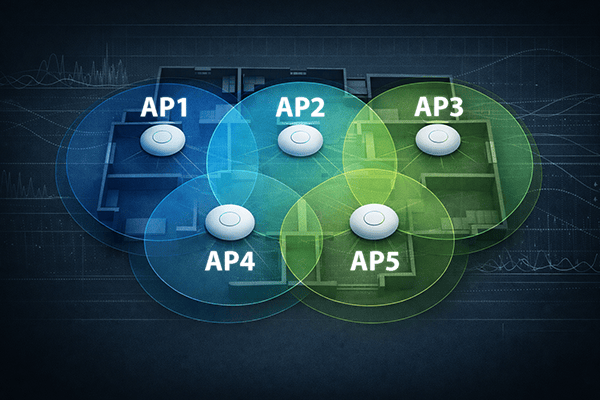

# Example Layout

This document shows a five-AP example for `UniFiWiFiOptimizer`.
It demonstrates the `neighbors` model in `config.yaml` and the resulting script output.

<p align="center">
  
</p>

## AP Layout

- upper row: `AP1`, `AP2`, `AP3`
- lower row: `AP4`, `AP5`

`AP2` sits at the center and overlaps with all four surrounding APs.
The outer APs overlap only with their direct neighbors.

## Neighbor Model

The neighbor list describes where clients are expected to roam between APs:

- `AP1`: `AP2`, `AP4`
- `AP2`: `AP1`, `AP3`, `AP4`, `AP5`
- `AP3`: `AP2`, `AP5`
- `AP4`: `AP1`, `AP2`, `AP5`
- `AP5`: `AP2`, `AP3`, `AP4`

## config.yaml

```yaml
controller:
  url: https://unifi.example.local
  api_key: ...

devices:
  ssh:
    user: ubnt
    password: ...

sites:
  default:
    environment: residential

    wlans:
      General: general_5g
      IoT: iot
      Guest: guest_5g

    neighbors:
      AP1: [AP2, AP4]
      AP2: [AP1, AP3, AP4, AP5]
      AP3: [AP2, AP5]
      AP4: [AP1, AP2, AP5]
      AP5: [AP2, AP3, AP4]
```

## Example Output (abbreviated)

The script first shows the site-level RF parameters, then checks each WLAN against its profile, and finally produces per-AP recommendations.

### Environment Summary

```text
Environment:               Residential
Target RSSI @ Neighbor:    -73 dBm to -67 dBm
Roaming Assistant:         -67 dBm
Minimum RSSI:              -73 dBm
```

These values are derived from `environment: residential` and are the same for all APs on the site.

### Per-WLAN Profile Check

Each WLAN is checked against its assigned profile:

```text
WLAN       General
Profile    general_5g

  Radio Setup:
  ✓ WiFi Band                        2.4 GHz, 5 GHz
  Roaming Assistance:
  ✓ Fast Roaming                     Enabled
  Hi-Capacity Tuning:
  ✓ Minimum Data Rate 2.4 GHz        11 Mbps
  ✓ Minimum Data Rate 5 GHz          24 Mbps
  ✓ Multicast and Broadcast Blocker  Disabled
  ✓ Multicast to Unicast             Disabled
  ✓ Proxy ARP                        Enabled
  Security:
  ✓ Security Protocol                WPA2/WPA3
  ✓ PMF                              Optional
  ✓ Hide WiFi Name                   Disabled
  ✓ Client Device Isolation          Disabled
  ✓ SAE Anti-clogging                10
  ✓ SAE Sync Time                    5
  Behaviour Controls:
  ✓ BSS Transition                   Enabled
  ✓ UAPSD                            Disabled
  ✓ DTIM Period 2.4 GHz              1
  ✓ DTIM Period 5 GHz                3
  ✓ Group Rekey Interval             3600 s
  ✓ Show Access Point Name in Beacon Disabled
```

Mismatches between the WLAN and its profile are flagged with `✗`.

### Per-AP Recommendations

An outer AP with two neighbors, both within the corridor:

```text
AP        AP1
MAC       f4:92:bf:aa:11:22

2.4 GHz  (Channel Width: 20 MHz, Channel: 1, TX Power: 9 dBm)

Neighbor AP:    RSSI @ Neighbor:
AP2             -71 dBm
AP4             -73 dBm

Recommendations:
  ✓ Transmit Power           Custom, 9 dBm
  ✓ Minimum RSSI             Disabled
```

The center AP with four neighbors and a TX power adjustment:

```text
AP        AP2
MAC       f4:92:bf:aa:33:44

5 GHz  (Channel Width: 80 MHz, Channel: 44, TX Power: 23 dBm)

Neighbor AP:    RSSI @ Neighbor:
AP1             -66 dBm
AP3             -65 dBm
AP4             -68 dBm
AP5             -67 dBm

Recommendations:
  ✗ Transmit Power           Custom, 19 dBm (reduce by 4 dBm)
  ✓ Roaming Assistant        Enabled, -67 dBm
  ✓ Minimum RSSI             Disabled
```

Here the integer-averaged neighbor RSSI (−66 dBm) is above the corridor center (−70 dBm), so the script recommends reducing TX power by 4 dBm (shift −4, quantized to −4 with `QUANTIZATION=1`).

An outer AP hitting the hardware maximum:

```text
AP        AP3
MAC       f4:92:bf:aa:55:66

5 GHz  (Channel Width: 80 MHz, Channel: 149, TX Power: 23 dBm)

Neighbor AP:    RSSI @ Neighbor:
AP2             -72 dBm
AP5             -78 dBm *

* Coverage gap – signal too weak at: AP5
  Consider repositioning this AP or adding a neighbor AP.

Recommendations:
  ✓ Transmit Power           Custom, 23 dBm
  ✓ Roaming Assistant        Enabled, -67 dBm
  ✓ Minimum RSSI             Disabled
```

The coverage warning only appears because TX power is already at the hardware maximum and cannot be increased further. `AP5` is projected below `TX_LO` (−73 dBm) even at full power.

## Notes

- AP names in `neighbors` must match the UniFi device names exactly (case-sensitive).
- AP names must be unique within the UniFi site.
- Keep neighbors symmetric when the physical overlap is symmetric.
- For multi-floor environments, include only APs that are meaningful RF neighbors across floors.
